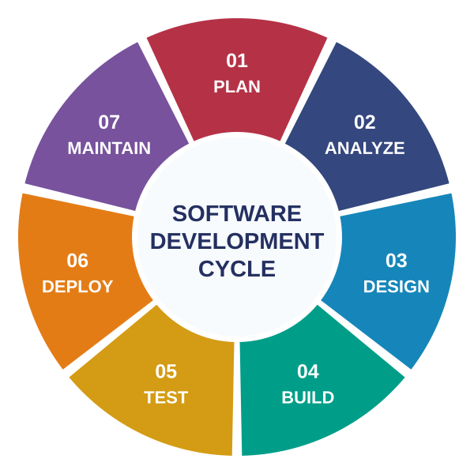
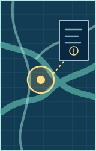
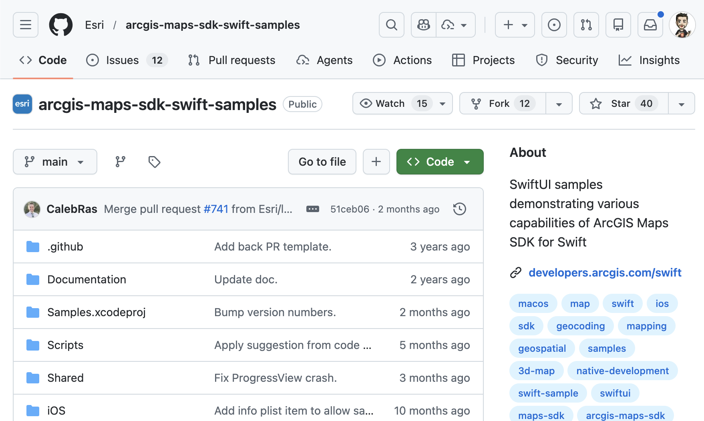
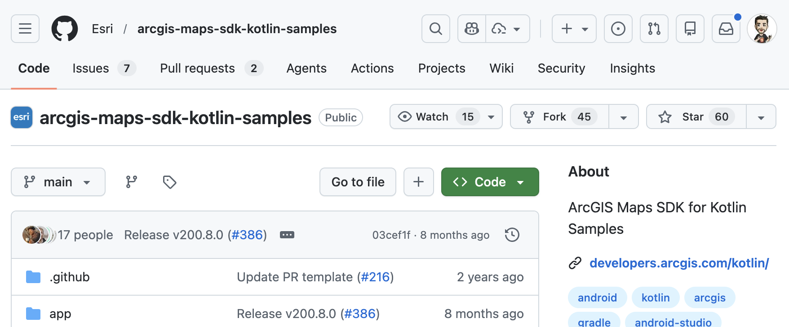
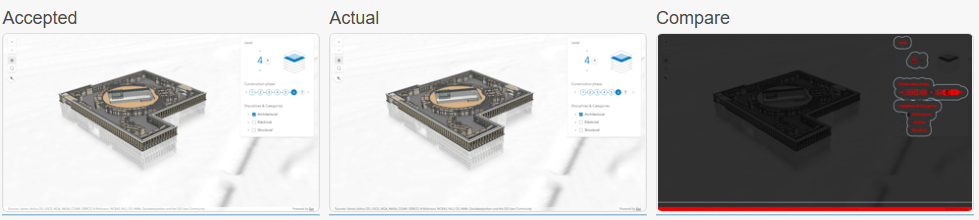

# AI across the development cycle

Sascha Brunner

<!--
- Timing: 0:30.
- AI can help across the development cycle.
- Show real work and possible workflows.
- Decide who leads at each step.
-->

---

CYCLE / OVERVIEW

# AI support fits across the development cycle.

At each stage, choose who leads and who helps.

<figure class="external-cycle-figure">
  
  <figcaption>Illustrative SDLC cycle · stages overlap and repeat</figcaption>
</figure>

<!--
- Timing: 0:50.
- The cycle repeats as we learn from tests and feedback.
- Lead with AI advice, or guide an agent drafting a solution.
- Keep the key decisions with the person.
- Source cue: SYNTHESIS — ArcGIS GeoBIM / ArcGIS Pro: agreed intent and human engineering judgment guide AI work.
-->

---

PLAN / FROM OBSERVATION

# Turn observations into a short PRD.

PRD = Product Requirements Document

  

    
<svg viewBox="0 0 64 64" aria-hidden="true"><path d="M5 32c7-11 16-17 27-17s20 6 27 17c-7 11-16 17-27 17S12 43 5 32z" fill="none" stroke="currentColor" stroke-width="3"/><circle cx="32" cy="32" r="10" fill="none" stroke="currentColor" stroke-width="3"/><circle cx="32" cy="32" r="4" fill="currentColor"/></svg><strong>Observe</strong>

    
<svg viewBox="0 0 64 64" aria-hidden="true"><path d="M9 12h35a7 7 0 0 1 7 7v22a7 7 0 0 1-7 7H26L13 57v-9H9a7 7 0 0 1-7-7V19a7 7 0 0 1 7-7z" fill="none" stroke="currentColor" stroke-width="3"/><path d="m19 31 8 8 17-18" fill="none" stroke="currentColor" stroke-width="4" stroke-linecap="round" stroke-linejoin="round"/></svg><strong>Agree</strong>

    
<svg viewBox="0 0 64 64" aria-hidden="true"><rect x="12" y="9" width="40" height="48" rx="4" fill="none" stroke="currentColor" stroke-width="3"/><path d="M23 20h19M23 32h19M23 44h12" fill="none" stroke="currentColor" stroke-width="3" stroke-linecap="round"/><path d="m16 42 3 3 5-6" fill="none" stroke="currentColor" stroke-width="3" stroke-linecap="round" stroke-linejoin="round"/></svg><strong>Test</strong>

    
  

  

    
SHORT PRD / ILLUSTRATIVE

    
User task<strong>Select a feature</strong>

    
Success<strong>Details appear</strong>

    
Check<strong>Test + screenshot</strong>

    
Open<strong>Who can access it?</strong>

  

01 PLAN

<!--
- Timing: 1:10.
- Start with a user task and a problem you have seen.
- Agree on the expected result, access rules and errors.
- Use a short PRD; AI can draft it or help find gaps.
- Product and engineering owners agree on the goal.
- Source cue: SYNTHESIS — ArcGIS GeoBIM: agree user needs and testable requirements before building; the PRD is illustrative.
-->

---

PLAN / PRD TO SDD

# From PRD to spec-driven development.

Agree on testable requirements before AI writes code.

  

    APPROVED SCENARIOS
    <strong>Agree → approve → build</strong>
    

ILLUSTRATIVE SCENARIO
<pre class="native-code">Given an accessible Web Scene
When I select a feature
Then its details appear</pre>

    <small>Same scenarios for tests and review.</small>
  

  

    ARCHITECTURE OPTIONS
    <strong>Faster prototypes. More options.</strong>
    
Compare approaches and agree together.

  

01 PLAN

<!--
- Timing: 1:20.
- Requirement: the user goal. Specification: behavior we can build and test.
- Developer and product engineer approve scenarios; reuse them in tests and review.
- Quick prototypes let us compare more architecture options.
- Agreement takes time; choose the approach together and write it down.
- Source cue: ESRI FEEDBACK — ArcGIS GeoBIM: reuse approved scenarios in QA and review; the architecture lesson is presenter experience.
-->

---

ANALYZE / CODEBASE

# Understand the app before changing code.

Ask AI to explain how the app works.

  

    
<svg viewBox="0 0 64 64" aria-hidden="true"><rect x="5" y="10" width="54" height="44" rx="4" fill="none" stroke="currentColor" stroke-width="3"/><path d="M5 21h54M22 40l7 7 14-17" fill="none" stroke="currentColor" stroke-width="3" stroke-linecap="round" stroke-linejoin="round"/></svg><strong>User tasks</strong>

    
<svg viewBox="0 0 64 64" aria-hidden="true"><path d="m23 17-15 15 15 15m18-30 15 15-15 15m-5-36-8 42" fill="none" stroke="currentColor" stroke-width="3.5" stroke-linecap="round" stroke-linejoin="round"/></svg><strong>Code</strong>

    
<svg viewBox="0 0 64 64" aria-hidden="true"><path d="M8 12c11-4 20-2 24 2 4-4 13-6 24-2v39c-11-4-20-2-24 2-4-4-13-6-24-2zM32 14v39M15 23h10M39 23h10M15 32h10M39 32h10" fill="none" stroke="currentColor" stroke-width="3" stroke-linecap="round" stroke-linejoin="round"/></svg><strong>Project rules</strong>

  

  

    
WHAT AI SHOULD RETURN

    
What the app does<strong>User tasks and behavior</strong>

    
Where to find it<strong>Code, tests and documentation</strong>

    
Still unclear<strong>Questions to investigate</strong>

  

  
  
  

02 ANALYZE

<!--
- Timing: 1:05.
- Ask about user tasks, code and project rules.
- Ask for an explanation, code links and open questions.
- Check it in the running app and against current SDK guidance.
- Know what to keep and where to work.
- Source cue: ESRI FEEDBACK — ArcGIS Pro / Web GIS SDK: code discovery, project guidance and documentation search.
-->

---

ANALYZE / ISSUE

# Make a reported issue actionable.

Record the facts before asking an agent to fix it.

  

    
<svg viewBox="0 0 64 64" aria-hidden="true"><path d="M12 31a20 20 0 1 1 6 16M12 31V17m0 14h14" fill="none" stroke="currentColor" stroke-width="3.5" stroke-linecap="round" stroke-linejoin="round"/><circle cx="33" cy="31" r="5" fill="currentColor"/></svg><strong>Reproduce</strong>

    
<svg viewBox="0 0 64 64" aria-hidden="true"><rect x="5" y="11" width="54" height="42" rx="3" fill="none" stroke="currentColor" stroke-width="3"/><path d="M32 11v42M15 28h9m-9 8h9m16-8h9m-9 8h9" fill="none" stroke="currentColor" stroke-width="3" stroke-linecap="round"/></svg><strong>Describe</strong>

    
<svg viewBox="0 0 64 64" aria-hidden="true"><rect x="10" y="9" width="44" height="46" rx="4" fill="none" stroke="currentColor" stroke-width="3"/><path d="m20 34 9 9 17-20" fill="none" stroke="currentColor" stroke-width="4" stroke-linecap="round" stroke-linejoin="round"/></svg><strong>Define success</strong>

  

  

    
EXAMPLE ISSUE

    
Problem<strong>Details stay after clearing selection</strong>

    
Expected<strong>Details disappear</strong>

    
Evidence<strong>Steps + screenshot</strong>

    
Test<strong>Select a feature, then clear it</strong>

  

  
  
  

02 ANALYZE

<!--
- Timing: 0:45.
- Find the steps that show the problem.
- Describe what happens and what should happen; include the environment and screenshot.
- Define the check; an agent can draft the issue from these facts.
- Source cue: ILLUSTRATION — ArcGIS GeoBIM practice: reproduce defects and agree expected behavior; this issue is fictional.
-->

---

DESIGN / UI OPTIONS

# Compare quick UI options before committing.

Illustrative alternatives based on a team's prototyping practice.

  

A · MINIMAL

<i></i>

Fast path to the main task

  

B · GUIDED

<i></i>

Select a feature

More cues for a first visit

  

C · POWER USER

<i></i>

<b></b><b></b><b></b>

More control, more complexity

Choose by observed behavior, not by prototype speed.

03 DESIGN

<!--
- Timing: 0:55.
- Web GIS SDK engineers report making more UI prototypes with AI.
- The three flows are examples; compare the same user task.
- Choose useful behavior and add it to the plan.
- Source cue: ESRI FEEDBACK — Web GIS SDK: create several quick UI prototypes to compare options.
-->

---

DESIGN / MODERNIZATION

# Move an app to newer technology.

Outdated technology. Migration is needed.

  

    START<strong>App on outdated technology</strong><small>Needs migration.</small>
  

  
↗↘

  

    
PATH A<strong>Migrate in place</strong><small>Update the existing code.</small>

    
PATH B<strong>Rebuild from scratch</strong><small>Create a new codebase.</small>

  

When rebuilding, use the old codebase to find edge cases. Improve the new app.

03 DESIGN

<!--
- Timing: 1:05.
- Update the old code step by step, or build a new app.
- Use the old code to find unusual cases, errors and access rules.
- Decide what to keep, fix or improve.
- Write down the agreed behavior and test the new app against it.
- Source cue: MY EXAMPLE — App migration/rebuild; Web GIS SDK feedback separately reports an AI-assisted Vitest migration.
-->

---
clicks: 1
---

BUILD / SCENE AUTHORING

# Start with a scene people can inspect.

An agent uses Scene Viewer to create a 3D scene from an existing Web Map.

  <ol class="native-steps">
    <li>01
<strong>Author</strong><small>Choose data, styling, pop-ups and the opening view.</small>
</li>
    <li>02
<strong>Save</strong><small>Check the Web Scene item and its access.</small>
</li>
    <li>03
<strong>Verify</strong><small>Check pop-ups, layers, sharing and attribution.</small>
</li>
  </ol>
  <figure class="scene-demo">
    

      
      <video v-if="$clicks >= 1" autoplay controls muted playsinline poster="/media/glowing-3d-hiking-scene-poster.jpg" aria-label="Accelerated recording of an agent authoring a hiking Web Scene in Scene Viewer">
        <source src="/media/glowing-3d-hiking-scene.mp4" type="video/mp4" />
      </video>
    

  </figure>

04 BUILD

<!--
- Timing: 1:05.
- The recording shows browser control, not an AI feature inside Scene Viewer.
- Recreate a Web Map in Scene Viewer with help from an agent.
- Check layers, pop-ups, sharing and attribution before reuse.
- Build and test the app around the scene.
- Source cue: MY EXAMPLE — Scene Viewer: recorded browser-agent scene authoring; separate from the email.
-->

---

BUILD / CROSS-SDK

# Existing samples can seed another SDK.

A working source behavior helps explore an equivalent in another language.

  <figure><figcaption>Swift samples · source behavior</figcaption></figure>
  →
  <figure v-click="-1"><figcaption>Kotlin samples · target pattern</figcaption></figure>

Adapt the pattern, then build, run and review the target result.

04 BUILD

<!--
- Timing: 0:30.
- Use a Swift SDK sample to draft a similar Kotlin sample.
- The repositories are starting points; no completed conversion is shown.
- Check the APIs, then build, run and review the target sample.
- Source cue: ILLUSTRATION — ArcGIS Maps SDK for Swift / Kotlin: cross-SDK sample adaptation; no completed conversion reported.
-->

---

BUILD / CODE QUALITY

# Use AI to help clean up a large codebase.

Business Analyst used agents for lint and TypeScript cleanup.

  
01 / SMALL TASKS<strong>Divide the work</strong><small>Clear scope + project rules</small>

  <b v-click="2" aria-hidden="true">→</b>
  
02 / AI HELP<strong>Draft the fixes</strong><small>Separate parts of the code</small>

  <b v-click="3" aria-hidden="true">→</b>
  
03 / CHECK<strong>Run checks and review</strong><small>Types, lint and app behavior</small>

Suggested workflow

Fewer errors do not prove the app works.

04 BUILD

<!--
- Timing: 0:45.
- Business Analyst used several agents for lint and TypeScript cleanup.
- The small-task workflow is a suggestion; run checks and review changes.
- Fewer errors do not prove correct app behavior; check that too.
- Source cue: ESRI FEEDBACK — Business Analyst: agents addressed ESLint and TypeScript errors; the task split is illustrative.
-->

---

TEST / PERFORMANCE

# Explore rendering variants in parallel.

Meet the visual target within CPU, GPU and memory budgets.

  
AI drafts variants<b>→</b>Run the same scene<b>→</b>Compare visual + resources

  
APPROACHVISUAL TARGETCPUGPUMEMORYDECISION

  
<strong>A · Full detail</strong>MEETSOKOVEROVERRevise

  
<strong>B · Fewer details</strong>MISSESOKOKOKRevise

  
<strong>C · Adaptive detail</strong>MEETSOKOKOKSHORTLIST

  
Illustrative runs · fixed scene, camera, data and device · shortlist still needs validation

05 TEST

<!--
- Timing: 1:10.
- Define the visual goal and CPU, GPU and memory limits.
- Keep the scene, camera, data and device the same.
- A, B and C are examples; test the chosen candidate on harder scenes.
- Compare the image, frame time and resource use.
- Source cue: ESRI FEEDBACK — ArcGIS Maps SDK for JavaScript: agents and performance tests explored Gaussian Splats and Accessor; the comparison rows are illustrative.
-->

---

TEST / VISUAL EVIDENCE

# A failed screenshot needs a diagnosis.

<figure class="sample-test-composite"></figure>

  
UI / COMPONENTS<strong>Sample code, Calcite alert or component change?</strong>

  
SCENE / MAP PIXELS<strong>SDK rendering or view-state change?</strong>

  
DATA<strong>Missing layers or changed layer appearance?</strong>

AI-ASSISTED TRIAGE<strong>Screenshots + logs + code history → likely cause → fix → rerun</strong>

05 TEST

<!--
- Timing: 1:45.
- The real report shows a temporary alert difference.
- Check three possible causes: UI, scene and data.
- AI investigation is proposed; this CI run did not use AI.
- Understand the alert timing before changing the reference image.
- Source cue: MY EXAMPLE — ArcGIS Maps SDK for JavaScript sample testing: real alert difference; AI diagnosis is proposed.
-->

---

TEST / WAITING FOR THE VIEW

# Wait for the view to be ready.

Copilot helped find dependencies on fixed delays.

  

    BEFORE / FIXED DELAY
    <strong>Wait a fixed time</strong>
    
Start<b aria-hidden="true">············</b>Check

    
Elapsed time does not prove readiness.

  

  

    AFTER / VIEW STATE
    <strong>Wait for the required state</strong>
    
Start<b aria-hidden="true">→</b>View state<b aria-hidden="true">→</b>Check

    
Tests now use <code>view.updating</code>.

  

The ready state depends on the test.

Understand the delay before removing it.

05 TEST

<!--
- Timing: 0:50.
- Fixed waits hid code dependencies and slowed the tests down.
- Copilot helped find those dependencies; tests changed to use view.updating.
- Understand why the delay exists, then wait for the required state.
- This is separate from the alert case; no measured speedup was reported.
- Source cue: ESRI FEEDBACK — Web GIS SDK: Copilot traced fixed-delay dependencies; tests changed to use view.updating.
-->

---

TEST / COVERAGE

# Run the same task across environments.

One laptop, multiple browsers, devices and external test providers.

  
  
  
  
  
  
Playwright

05 TEST

<!--
- Timing: 1:25.
- Possible setup: run the same task across browsers, systems and real devices.
- Playwright can automate browser tasks; an agent can collect screenshots and logs.
- Record the environment for each result; mark untested targets as not run.
- Source cue: ILLUSTRATION — Proposed browser/device coverage; general engineering feedback supports agents testing user tasks.
-->

---

TEST + DEPLOY / REPEATABILITY

# Handle Non-Deterministic

AI proposals can vary. Make the surrounding workflow repeatable.

  

    

      <svg viewBox="0 0 64 64" aria-hidden="true"><rect x="12" y="9" width="40" height="48" rx="4"/><path d="M23 20h19M23 32h19M23 44h12m-19-4 4 4 6-7"/></svg>
      
01 / INPUTS<strong>Make requirements explicit</strong><small>Stable task, data and environment</small>

    

    

      <svg viewBox="0 0 64 64" aria-hidden="true"><rect x="7" y="12" width="50" height="40" rx="4"/><path d="m17 25 9 7-9 7m17 1h13"/></svg>
      
02 / OPERATIONS<strong>Use scripts and tools</strong><small>Repeat the agreed steps</small>

    

    

      <svg viewBox="0 0 64 64" aria-hidden="true"><circle cx="32" cy="32" r="24"/><path d="m19 32 9 9 18-21"/></svg>
      
03 / CHECKS<strong>Test agreed behavior</strong><small>Automated checks with clear criteria</small>

    

    

      <svg viewBox="0 0 64 64" aria-hidden="true"><circle cx="27" cy="27" r="17"/><path d="m40 40 16 16M19 26h16m-16 7h10"/></svg>
      
04 / ACCEPTANCE<strong>Review the evidence</strong><small>Check results before accepting</small>

    

  

  
DEPLOY
<strong>AI advice cannot replace release gates.</strong><small>Reviewed scripts · required checks · approval rules</small>

06 DEPLOY

<!--
- Timing: 1:15.
- AI results can vary; make the work around AI repeatable.
- Use clear requirements, stable inputs, scripts, behavior checks and evidence review.
- An access-rule reminder helps; a regression test checks whether the rules still hold.
- Enforce release gates; AI advice cannot replace them. Check the deployed app as its users.
- Source cue: SYNTHESIS — ArcGIS GeoBIM checks and general engineering guidance on reproducibility; deployment gates are our recommendation.
-->

---

MAINTAIN / REUSABLE CHECKS

# Turn repeated work into tools and skills.

Esri teams use skills for code discovery and checks.

  <ul class="native-lines">
    <li v-click="1"><strong>Skill: instructions</strong></li>
    <li v-click="2"><strong>Tool: runs a task</strong></li>
    <li v-click="3"><strong>Package once, reuse</strong><small>Across tasks and sessions</small></li>
  </ul>
  

    
ILLUSTRATIVE REVIEW SKILL

    <pre class="native-code">1. Read the project rules
2. Check the change + callers
3. Call check tool; stop on failure
4. Report results for review</pre>
  

Enforce required checks with tools and CI.

07 MAINTAIN

<!--
- Timing: 0:50.
- A skill gives instructions; a tool runs a task.
- Teams use skills for code and checks; saving time and tokens is a recommendation.
- Call the check tool, report results and stop on failure; tools and CI enforce required checks.
- Source cue: ESRI FEEDBACK — Web GIS SDK / ArcGIS Pro: reusable skills and tools; general engineering feedback recommends them for speed, token savings and reproducibility.
-->

---

MAINTAIN / DOCUMENTATION

# Write useful docs. Test their steps.

Write docs with the change, then check the guide against the running app.

<ProjectGuidance />

A mismatch can mean a mistake in the guide or the software.

07 MAINTAIN

<!--
- Timing: 0:55.
- Write developer and user docs with the code and tests.
- Documentation search helps the agent find guidance.
- Review the test plan, use test data and set a time limit.
- Follow the guide in the app; fix the guide or software when they differ.
- Source cue: ESRI FEEDBACK — Web GIS SDK documentation search; general engineering guidance recommends writing docs with code and testing their steps.
-->

---

MAINTAIN / LONG TASKS

# Write down progress before context is lost.

An agreed decision can disappear from a long conversation.

  

    WITHOUT A HANDOVER / ILLUSTRATIVE
    
<small>Agreed earlier</small><strong>Keep the access rules.</strong>

    <b>↓ Conversation shortened</b>
    
<small>Later continuation</small><strong>Agent changes the access rules.</strong>

  

  

    
HANDOVER / ILLUSTRATIVE

    
Goal<strong>Feature details appear</strong>

    
Decision<strong>Keep access rules</strong>

    
Done<strong>Details UI updated</strong>

    
Checks<strong>Type check passed</strong>

    
Next<strong>Test feature selection</strong>

  

Save the record. Read it before continuing. Check the decision.

07 MAINTAIN

<!--
- Timing: 0:55.
- Shortening the conversation can make the agent forget an agreed decision.
- Save the goal, decisions, work done, check results and next step.
- Read the record before continuing and check that the decision still holds.
- The access-rule example is illustrative; the record helps but gives no guarantee.
- Source cue: ESRI FEEDBACK — General engineering experience: save progress and reread it after context compression or a focused handover; the access-rule example is illustrative.
-->

---

BEHIND THE DECK

# Create the presentation inside VS Code.

Prompt an agent in VS Code; Slidev renders editable Markdown, HTML and SVG.

  

    
ILLUSTRATIVE PROMPT IN VS CODE

    <blockquote>“Add the SDLC SVG and my Scene Viewer recording to this editable Slidev deck.”</blockquote>
    
<code>slides.md</code><code>theme.css</code><code>assets/diagrams/*.svg</code><code>public/media/*.mp4</code>

  

  

    
PREVIEW IN SLIDEV

    

      <figure><figcaption>Prompted SVG</figcaption></figure>
      <figure><figcaption>Captured video frame</figcaption></figure>
    

  

Prompt → edit → preview → capture → refine.

<!--
- Timing: 0:45.
- This deck was made in VS Code with an agent and Slidev.
- I supplied the video; the agent added it and made a still frame.
- The files stay editable; preview, improve and review the result.
- Source cue: MY EXAMPLE — Slidev / VS Code: actual deck-authoring workflow; separate from the email.
-->

---

HANDOVER

# Start with one small, clear task.

Use these five steps on your next development task.

<ol class="first-task-steps" aria-label="Five steps to start using AI on a development task">
  <li v-click="1">1<svg viewBox="0 0 64 64" aria-hidden="true"><rect x="12" y="9" width="40" height="48" rx="4" fill="none" stroke="currentColor" stroke-width="3"/><path d="M23 22h18m-18 10h18m-18 10h12" fill="none" stroke="currentColor" stroke-width="3" stroke-linecap="round"/></svg><strong>Choose a task</strong><small>One useful change</small></li>
  <li v-click="2">2<svg viewBox="0 0 64 64" aria-hidden="true"><circle cx="32" cy="32" r="24" fill="none" stroke="currentColor" stroke-width="3"/><path d="m19 33 9 9 18-21" fill="none" stroke="currentColor" stroke-width="4" stroke-linecap="round" stroke-linejoin="round"/></svg><strong>Define success</strong><small>Expected behavior</small></li>
  <li v-click="3">3<svg viewBox="0 0 64 64" aria-hidden="true"><path d="M8 12c11-4 20-2 24 2 4-4 13-6 24-2v39c-11-4-20-2-24 2-4-4-13-6-24-2zM32 14v39M15 24h10m14 0h10M15 34h10m14 0h10" fill="none" stroke="currentColor" stroke-width="3" stroke-linecap="round" stroke-linejoin="round"/></svg><strong>Give context</strong><small>Code, rules, examples</small></li>
  <li v-click="4">4<svg viewBox="0 0 64 64" aria-hidden="true"><rect x="5" y="10" width="54" height="44" rx="4" fill="none" stroke="currentColor" stroke-width="3"/><path d="M5 21h54m-39 18 9 8 17-20" fill="none" stroke="currentColor" stroke-width="3" stroke-linecap="round" stroke-linejoin="round"/></svg><strong>Run checks</strong><small>Tests and running app</small></li>
  <li v-click="5">5<svg viewBox="0 0 64 64" aria-hidden="true"><circle cx="27" cy="27" r="17" fill="none" stroke="currentColor" stroke-width="3"/><path d="m40 40 16 16m-38-29 6 6 12-14" fill="none" stroke="currentColor" stroke-width="3" stroke-linecap="round" stroke-linejoin="round"/></svg><strong>Review results</strong><small>Evidence and next step</small></li>
</ol>

<!--
- Timing: 0:45.
- Start with one small task; define success and give the agent relevant context.
- Run tests, check the app and review the results.
- Record what works; hand over to Raul on limits, risks and responsible use.
- Source cue: SYNTHESIS — ArcGIS GeoBIM, ArcGIS Pro and Web GIS SDK: clear tasks, context, checks and reviewed results.
-->
