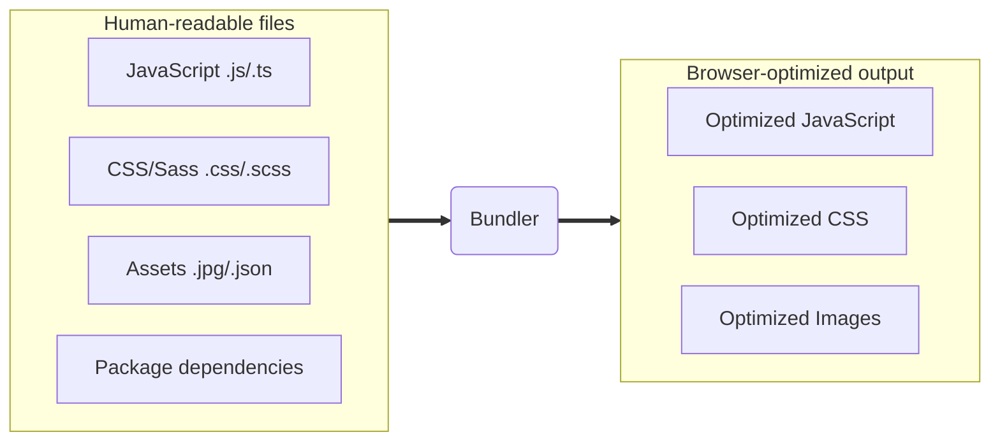
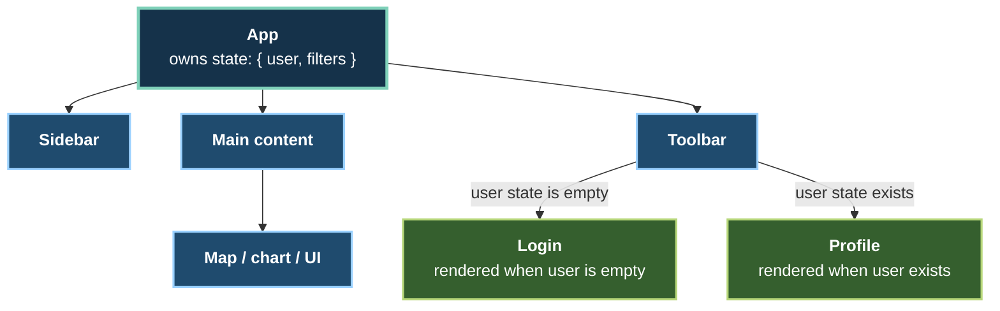
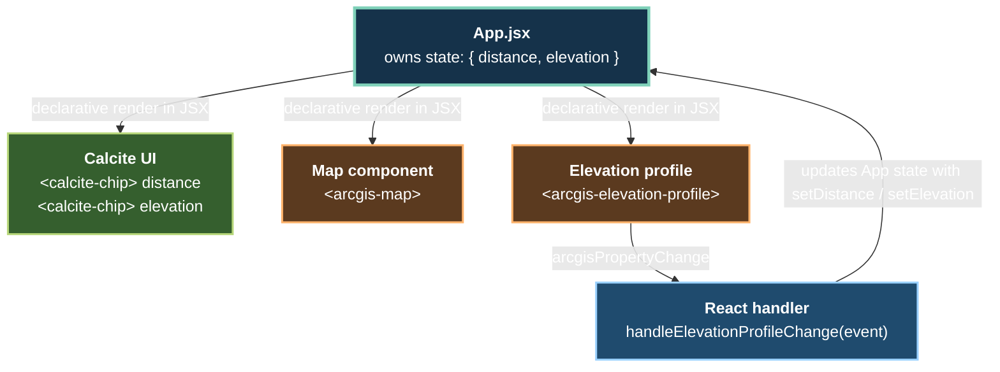

## ArcGIS Maps SDK for JavaScript:<br>App Development with Components<br>– Using Frameworks

Stefan Schläfli · Sascha Brunner

<!--
- One app, five stages: HTML → Vite → React → TypeScript → extracted component.
- Explain what each stage improves for the developer.
-->

---
is: feedback
---

<!--
- Invite feedback through the session survey.
-->

---

# Previous session (earlier today)

[ArcGIS Maps SDK for JavaScript: App Development with Components – Programming Patterns](https://registration.esri.com/flow/esri/26euroepcdev/deveventportal/page/detailed-agenda/session/1785494574001001ahF2)

**Wednesday, 21 October · 09:00–10:00 CEST**  
Harmonie Hall A–C, Level C2 · Congress Center

**Speakers:** Stefan Schläfli · Julie Powell

- Core concepts and programming patterns for SDK web components
- Map and scene components, including functionality from legacy widgets
- Charts and coding components

First in the four-part series. This session builds on those foundations.

<!--
- Build on the earlier component programming patterns session.
- Baseline: connected map, table, search, and elevation profile.
-->

---

# Today's session

Second of four sessions · Wednesday, 21 October · All times CEST

| Time            | App Development with Components                                                                                                                              |
| --------------- | ------------------------------------------------------------------------------------------------------------------------------------------------------------ |
| 09:00–10:00     | [Programming Patterns](https://registration.esri.com/flow/esri/26euroepcdev/deveventportal/page/detailed-agenda/session/1785494574001001ahF2)                |
| **10:30–11:30** | **[Using Frameworks — this session](https://registration.esri.com/flow/esri/26euroepcdev/deveventportal/page/detailed-agenda/session/1785494727635001W1Oa)** |
| 13:00–14:00     | [User Experience](https://registration.esri.com/flow/esri/26euroepcdev/deveventportal/page/detailed-agenda/session/1785494866247001NFxW)                     |
| 14:30–15:30     | [Extending and Styling](https://registration.esri.com/flow/esri/26euroepcdev/deveventportal/page/detailed-agenda/session/1785495003196001fwKB)               |

Today: Calcite, ArcGIS Maps SDK for JavaScript, bundlers, and frameworks.

<!--
- Locate this talk in the four-session conference series.
- Our progression: HTML → Vite → React → TypeScript → encapsulation.
- Point to this afternoon for deeper UX and styling coverage.
-->

---

# Calcite Design System

- Platform-agnostic design system by Esri
  - Design guidelines including accessibility, iconography, theming, and
    typography
  - Ensures a consistent, compelling, and cohesive user experience across
    products
- Includes **Calcite components**, an extensive library of reusable web
  components
  - Framework-agnostic, W3C standards-based, and customizable
  - Responsive and follows WCAG for accessibility
- More Calcite guidance in [User Experience](https://registration.esri.com/flow/esri/26euroepcdev/deveventportal/page/detailed-agenda/session/1785494866247001NFxW) later today, 13:00–14:00 CEST

{ width=250 }

<!--
- Identify Calcite navigation, panels, and statistics chips in the app.
- Highlight reusable UI and design guidance.
- Consider accessibility when composing the application.
- Switch to the online Calcite documentation: https://developers.arcgis.com/calcite-design-system/ (next slide).
-->

---
layout: iframe

url: https://developers.arcgis.com/calcite-design-system/
---

<!--
- Open a component reference.
- Point out properties, slots, and styling guidance.
- Keep the tour focused on where to find answers.
-->

---

# ArcGIS Maps SDK for JavaScript

- A comprehensive and powerful Web GIS mapping library
- Allows developers to build apps where people create, analyze, collaborate on,
  and share maps
- Three main parts of the SDK:
  - **Core API** - The main functionality for maps, layers, data visualization,
    and client-side analysis through its classes, methods, properties, events,
    and type definitions.
  - **Components** - Web components designed to encapsulate complex
    functionality and styling into small chunks of HTML markup (i.e.,
    declarative UI).
  - **Documentation** - Includes docs for getting started, programming patterns,
    tutorials, application templates, sample code, and references.

<!--
- Components: packaged mapping functionality.
- Core API: custom application logic.
- Documentation: guidance connecting both approaches.
- Switch to the online SDK documentation: https://developers.arcgis.com/javascript/latest/; then return to the slides.
-->

---

# How to get the SDK into your app

<v-clicks :at="0">

- Include the ArcGIS CDN in script tag applications for prototyping and getting
  started quickly
  - Single HTML file with no build step
    - Prebuilt versions of the SDK and Calcite are hosted on the ArcGIS CDN
  - Syntax for including modules:
    - `const WebMap = await $arcgis.import("@arcgis/core/WebMap.js");`
- Add the SDK as a dependency when building applications that scale
  (packages installed with pnpm: `@arcgis/core`, `@arcgis/map-components`,
  `@esri/calcite-components`)
  - JavaScript runtime environment and package manager required
  - Work with a bundler (Vite, Parcel, Webpack) and framework (React, Angular,
    Vue)
  - Syntax for including modules:
    - `import WebMap from "@arcgis/core/WebMap.js";`

</v-clicks>

<!--
- Start with the CDN approach visible. Click once to reveal the pnpm approach and its nested points.
- Connect to the first session: start from the same component-based HTML app and its CDN loading approach.
- The CDN supplies hosted SDK files directly to the browser.
- pnpm is the package manager: it downloads packages into node_modules and records dependencies in package.json and pnpm-lock.yaml.
- Name the packages: @arcgis/core for the core API, @arcgis/map-components for mapping components, and @esri/calcite-components for the surrounding UI.
- Vite resolves imports from those installed packages and prepares the browser app.
- Map components are installed from @arcgis/map-components and imported by the application.
- For these existing demos, use pnpm install --frozen-lockfile to reproduce the locked versions.
- Frameworks are optional; the first Vite demo uses plain JavaScript.
-->

---
layout: iframe-right
url: https://developers.arcgis.com/javascript/latest/system-requirements/
---

# What you need to install and run the SDK

- An up-to-date browser
- A JavaScript runtime environment
  - Node.js
- And a package manager
  - pnpm (install separately; pinned version in `package.json`)
- For more information, see the SDK's
  [system requirements](https://developers.arcgis.com/javascript/latest/system-requirements/)
  documentation

<!--
- Browser: runs the application.
- Node and the pnpm package manager: run development tools.
- These demos use pnpm and pnpm-lock.yaml; keep using pnpm install --frozen-lockfile to reproduce their dependencies.
- Check SDK requirements and repository setup instructions.
-->

---

# Scaffold a new app using a single command

- Reminder - We’ll be building on the app from session Part 1 as a starting
  point
- But, you can create a new app using a single command:
  - Run `pnpm create @arcgis` in your terminal and follow the prompts,
  - or skip the prompts by using `pnpm dlx @arcgis/create -n my-arcgis-app -t vite`
  - This CLI tool uses
    [git-sparse-checkout](https://git-scm.com/docs/git-sparse-checkout) to fetch
    app templates from the
    [Esri/jsapi-resources](https://github.com/Esri/jsapi-resources) repository

<!--
- Scaffold command: starting project.
- Existing app: follow manual setup guidance.
- Inspect templates in `jsapi-resources`.
-->

---
layout: iframe
url: https://developers.arcgis.com/javascript/latest/get-started/
---

<!--
- Locate package installation and framework guidance.
- Preview the component type references used later in the React + TypeScript demo.
-->

---

# index.html demo

Start with the HTML app from the previous session.

Use the ArcGIS CDN to load components without a build step.

Demo source: `demo/0-vanilla`

<!--
1. Open `demo/0-vanilla`; select a trail.
2. Show the connected map, table, popup, and elevation profile.
3. Open `index.html`: CDN entry and component markup.
4. Point to `main.js` for application behavior.
-->

---
layout: intro
---

# Using Bundlers

<!--
- Start from the working baseline app.
- Introduce the development and packaging workflow a bundler adds.
-->

---

# What are bundlers?

Bundlers transform the code that is easiest for developers to write into code
that is most performant for the browser to run.



<!--
- Follow the diagram: source files + dependencies → tooling → browser output.
- Explain that optimization depends on the tooling and configuration.
-->

---

# Bundler benefits

1. Optimize performance (reduce file sizes, split bundles...)
2. Improve development experience (live updates...)
3. Permits consumption of packages installed with pnpm
4. Make testing code simpler

Bonus: can extend the bundlers using plugins (React support, SVG imports,
bundle analysis)

<!--
- Show saved changes appearing in the browser.
- Introduce the production build command.
- Mention dependencies and plugins.
- Bundling alone does not provide tests.
-->

---

# Examples of bundlers

- Parcel
- Webpack
- Vite
  - Used by many Esri teams
  - Great developer experience
  - Large and rapidly growing community

<!--
- Use Vite as the concrete example.
- Focus on its development workflow.
-->

---
layout: center
---

# Demo: Get started with Vite

Local source: `demo/1-javascript`

```sh
cd demo/1-javascript
pnpm install --frozen-lockfile
pnpm run dev
```

<!--
1. Open `demo/1-javascript`.
2. Show `package.json`: scripts and dependencies.
3. Trace `index.html` → `src/main.js` → component imports.
4. Change the navigation heading; save and show the browser update.
5. Undo the edit.
6. Recap: same mapping components and application purpose.
-->

---

# Dependencies

- Your application can consume other packages
- Use [npmjs.com](https://www.npmjs.com/) to find packages or find out the
  latest version number

<!--
- Dependencies supply application functionality or development tooling.
- Manifest: what the project needs.
- Documentation and release notes: what packages provide and what changes.
-->

---

# Dependency vs devDependency

package.json:

```json
  // Required for the app to run
  "dependencies": {
    "@arcgis/core": "~5.1.25",
    "@arcgis/map-components": "~5.1.25",
    "@esri/calcite-components": "~5.1.2",
    "react": "^19.2.4",
    "react-dom": "^19.2.4"
  },
  // Only used during development/build
  "devDependencies": {
    "vite": "^8.3.0",
    "typescript": "7.0.2",
    "@vitejs/plugin-react-swc": "^4.3.3",
    "@types/react": "^19.2.14",
    "@types/react-dom": "^19.2.3"
  }
```

<!--
- Runtime: SDK, Calcite, and React.
- Development/build: Vite, React plugin, TypeScript, and type definitions.
- Manifest: version ranges.
- Lockfile: resolved versions.
-->

---

# Semantic versioning

Example: `5.1.25` → major **5**, minor **1**, patch **25**

`<major>.<minor>.<patch>`

- **major**: breaking changes - read the release notes
- **minor**: backward-compatible features
- **patch**: backward-compatible fixes

Compatibility is the specification’s promise; verify updates with builds and tests.

<!--
- Explain major, minor, and patch.
- Describe intended compatibility.
- Verify updates with release notes, builds, and application checks.
-->

---

# Semantic versioning

As of 5.0.0, `@arcgis/*` packages follow semantic versioning.

| Range     | Allows                                      |
| --------- | ------------------------------------------- |
| `~5.1.25` | Patches: `>=5.1.25 <5.2.0`                  |
| `^5.1.25` | Minor and patch releases: `>=5.1.25 <6.0.0` |

Commit `pnpm-lock.yaml` to record the resolved dependency versions.

Use `pnpm install --frozen-lockfile` to install those versions reproducibly.

<!--
- Tilde in this example: patch updates.
- Caret in this example: minor and patch updates within the major version.
- `pnpm install --frozen-lockfile`: install the locked dependency tree.
- Requires agreement between the lockfile and `package.json`.
-->

---

# Publishing

1. Run the build command: `pnpm run build`
2. Deploy the `dist` folder anywhere!
   - any hosting provider (GitHub Pages, Vercel)
   - or local server (NGINX, Microsoft IIS, Apache)

<!--
1. Run `pnpm run build` in `demo/1-javascript`.
2. Inspect `dist/index.html` and generated assets/chunks.
3. Explain deployment to static hosting.
4. Use `pnpm run preview` to inspect the built app locally.
-->

---

# Asset handling

- By default, `dist/` does not include component images and translation files
- Instead, they are loaded from Esri's CDN (fast server in the cloud)
- They can be made
  [fully self-hosted](https://developers.arcgis.com/javascript/latest/working-with-assets/)
  if needed


<!--
- Point to SDK CDN requests in the capture.
- Explain runtime asset loading and the self-hosting guidance.
- Offline use also requires considering web maps, basemaps, feature data, and elevation services.
-->

---

# Fun fact

These slides are built with Vite. ✨

(with help from [Slidev](https://sli.dev/))

<!--
- These slides use Vite through Slidev.
- They are published as static output.
- Transition: organizing UI state and rendering with a framework.
-->

---
layout: intro
---

# Using frameworks

<!--
- Keep the same mapping task.
- Introduce state-driven UI, types, and a component boundary.
-->

---

# Frameworks

- Frameworks make app development easier by providing more structure to the way
  we write applications
- React, Angular, and Vue are widely used options
- Web components work in most major frameworks because they are standards-based
- Start with the [application templates](https://github.com/Esri/jsapi-resources/tree/main/templates) or run `pnpm create @arcgis`

<!--
- Frameworks provide shared application patterns.
- Web components integrate with major frameworks; syntax differs.
- Use React for the examples.
-->

---

# React ⚛️

- A library for building user interfaces
- Encourages building app from "components" - reusable building blocks
- Top down data flow
- Declarative rendering and events
  - JSX syntax, which is a mix of JavaScript and HTML
  - TSX: JSX in TypeScript files (`.tsx`)
- Easy state management with "hooks"
- Components re-render when state changes, so no need for query selectors or
  manual DOM manipulation
- React 19 has support for web components out of the box

<!--
- Describe UI from inputs and state.
- State changes lead to updated rendering.
- Distinguish React components from browser web components.
- Show how the two work together.
-->

---
layout: full
---



<!--
- Start at App and follow the branches.
- Empty user state → Login.
- Populated user state → Profile.
-->

---
layout: center
---

<video width="640" height="480" controls>
    <source src="./assets/react-tree.webm" type="video/webm">
</video>

<!--
- Play the animation.
- Follow the login/profile branch as state changes.
- Connect the idea to the mapping app’s statistics chips.
-->

---
layout: center
---

# Demo: Get started with React

Local source: `demo/2-react`

```sh
cd demo/2-react
pnpm install --frozen-lockfile
pnpm run dev
```

<!--
1. Open `demo/2-react`: `package.json` and `vite.config.js`.
2. Show the root element in `index.html`, then `createRoot` in `src/main.jsx`.
3. In `src/App.jsx`, locate distance/elevation state.
4. Follow `handleElevationProfileChange` to the conditional chip markup.
5. Select a trail → wait for statistics → clear selection → select again.
6. Show object properties and function callbacks passed through JSX.
-->

---

# React in this app



<!--
- Trace: component event → handler → state update → rendered chips.
- `event.target`: emitting component.
- `event.detail`: information about the change.
- Filter property-change events before processing results.
-->

---

# Summary of benefits from React

- Declarative rendering
- Easy to pass properties to components
- Easier event logic
- No need for query selectors
- Easy to consume web components

<!--
- Properties and callbacks sit beside markup.
- Chips render from state.
- Less manual DOM wiring in this app.
- React applications can still need element references.
-->

---
layout: two-cols
class: code-comparison
---

# Vanilla JavaScript

### Find elements

```js
const profile = document.querySelector(
  'arcgis-elevation-profile'
);
const chip = document.querySelector(
  '#distance'
);
```

### Update the DOM

```js
chip.textContent = distance;
```

::right::

### Watch analysis progress

```js
const analysisView =
  await view.whenAnalysisView(
    profile.analysis
  );
watch(
  () => analysisView.progress,
  (progress) => {
    if (progress !== 1
      || !profile.feature) return;
    const stats = analysisView.statistics;
    const value = stats?.maxDistance ?? 0;
    const unit =
      profile.effectiveDisplayUnits.distance;
    chip.textContent =
      `${value.toFixed(2)} ${unit}`;
  }
);
```

<!--
- Distance-only excerpt; full demo also handles elevation and clearing selection.
- Import `watch` from `@arcgis/core/core/reactiveUtils.js`.
- Run setup inside an async function after the map view and profile component are ready.
- `view` is the associated map view.
- Follow: analysis progress → `analysisView.statistics` → update the existing chip.
-->

---
layout: two-cols
class: code-comparison
---

# React

### State and rendering

```jsx
const [distance, setDistance] =
  useState('');

return (
  <>
    {distance && (
      <calcite-chip>
        {distance}
      </calcite-chip>
    )}
    <arcgis-elevation-profile
      onarcgisPropertyChange={onChange}
    />
  </>
);
```

::right::

### Handle the event

```jsx
async function onChange(event) {
  const profile = event.target;
  if (event.detail.name !== 'progress'
    || profile.progress !== 1) return;
  const view = profile.view;
  if (!view) return;
  await view.when();
  const analysisView =
    await view.whenAnalysisView(
      profile.analysis
    );
  if (!profile.feature) return;
  const value =
    analysisView.statistics?.maxDistance ?? 0;
  const unit =
    profile.effectiveDisplayUnits.distance;
  setDistance(
    `${value.toFixed(2)} ${unit}`
  );
}
```

<!--
- Both excerpts belong inside the same React component; import `useState`.
- The app connects the profile to the map and selected trail.
- Follow: filter progress event → await analysis view → read statistics → update state.
- Use `effectiveDisplayUnits` for the displayed unit.
- The fragment groups the returned elements.
- Distance-only excerpt; full demo also handles elevation and clearing selection.
-->

---

# TypeScript 🦾

- TypeScript is a superset of JavaScript
- Adds static types to JavaScript
- Improves developer experience and code quality
- The Maps SDK's components and Calcite's components come with TypeScript
  definitions out of the box

<!--
- Types describe expected inputs and outputs.
- Show their value for editor feedback.
- SDK and Calcite packages include type definitions.
- Types complement runtime checks and testing.
-->

---
layout: center
---

# Demo: Get started with React + TypeScript

Local source: `demo/3-typescript`

```sh
cd demo/3-typescript
pnpm install --frozen-lockfile
pnpm run dev
```

<!--
1. Open `demo/3-typescript`: `package.json`, `tsconfig.json`, and `src/vite-env.d.ts`.
2. In `src/App.tsx`, hover `popupDockOptions: DockOptions`.
3. Add an unknown property; show the diagnostic; undo the edit.
4. Show `round(value?: number)` and the typed map event.
5. Demonstrate `event.target` completion and the unavailable-map guard.
6. Restore the code; run `pnpm run typecheck`.
7. Explain that type checking is separate from the Vite build.
-->

---

# Summary of benefits from TypeScript

- Improved developer experience
- Static types
- IntelliSense
- Error checking
- Give us more confidence in the code we write

<!--
- Recap completion, API documentation, readable contracts, and early diagnostics.
- Mention automatic type inference.
- Transition: group related logic behind a component boundary.
-->

---

# Encapsulating complexity with components

- Application logic can be encapsulated into smaller components
- This makes it easier to manage and reason about the code
- For example, we can create a new component for the elevation profile logic in
  our app

**Demo:** `demo/4-typescript-react-encapsulation`

```sh
cd demo/4-typescript-react-encapsulation
pnpm install --frozen-lockfile
pnpm run dev
```

<!--
1. Compare `src/App.tsx` in `demo/3-typescript` and `demo/4-typescript-react-encapsulation`.
2. Locate `ElevationProfilePanel`: a separate component in the same file.
3. Show its `selectedGraphic` prop, local state, handler, and markup.
4. Show the parent’s conditional render.
5. Select a trail to reveal the panel; clear selection to remove it.
-->

---

# Other frameworks

- Angular and Vue also support web components.
- [Getting started with Angular](https://developers.arcgis.com/javascript/latest/angular/)
- [Vue template application](https://github.com/Esri/jsapi-resources/tree/main/templates/js-maps-sdk-vue)
- [jsapi-resources](https://github.com/Esri/jsapi-resources) repo has samples
  for many frameworks
- Get started with `pnpm create @arcgis` and select your framework of choice

<!--
- Transfer the ideas: properties/events, state ownership, types, and build tooling.
- Point to Angular guidance, the Vue template, and the scaffold command.
-->

---

# Continue the series this afternoon

**Wednesday, 21 October · Harmonie Hall D–E, Level C2 · Congress Center**

### [User Experience](https://registration.esri.com/flow/esri/26euroepcdev/deveventportal/page/detailed-agenda/session/1785494866247001NFxW)

**13:00–14:00 CEST · Keith Morrison**

Build the user experience with SDK components and Calcite Design System.

### [Extending and Styling](https://registration.esri.com/flow/esri/26euroepcdev/deveventportal/page/detailed-agenda/session/1785495003196001fwKB)

**14:30–15:30 CEST · Keith Morrison**

Explore branding, theming, and customization strategies for your apps.

<!--
- Vite: development and build tooling.
- React: UI updates driven by state.
- TypeScript: editor feedback.
- Components: related behavior grouped together.
- Point to the two follow-on sessions this afternoon.
-->

---
layout: center
---

# Questions?

<!--
- Invite questions.
- Return to relevant source examples where useful.
-->

---
src: ./footer.md
---
