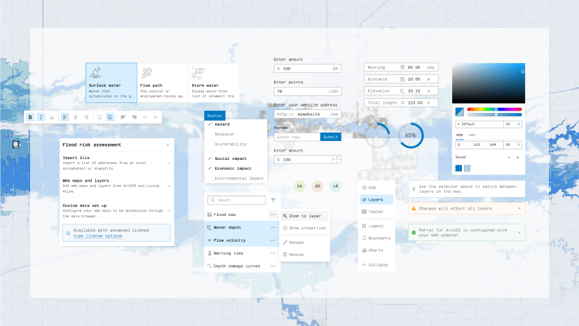
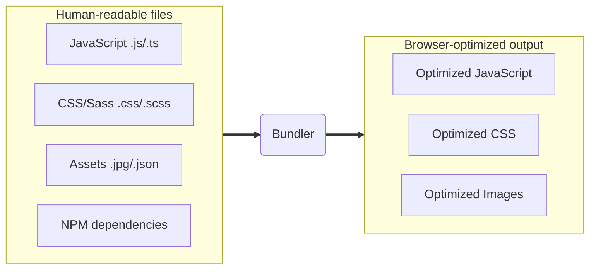
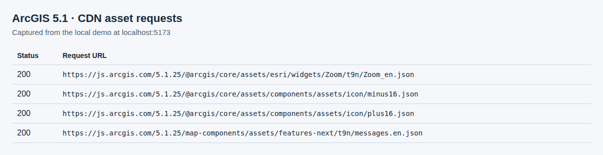
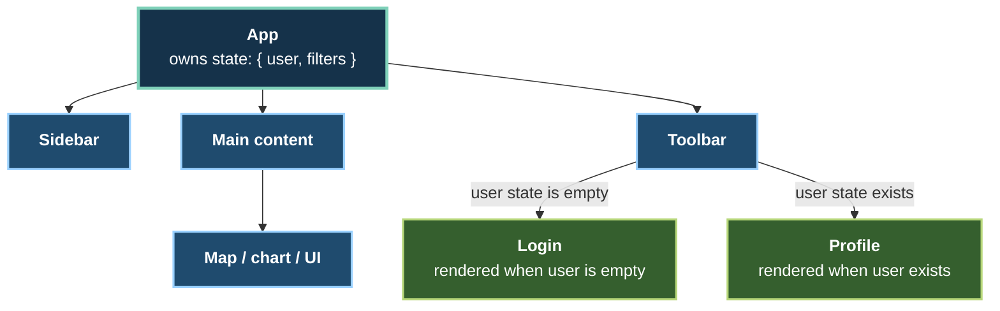
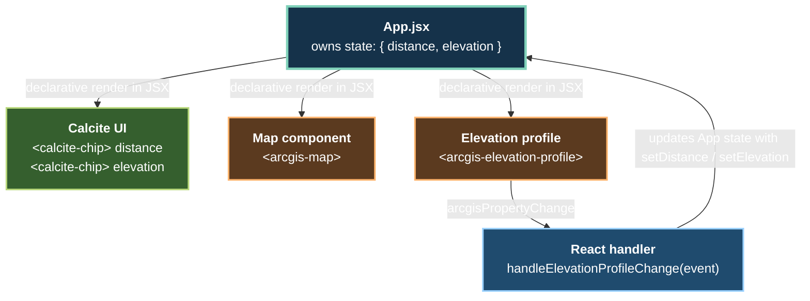

## ArcGIS Maps SDK for JavaScript:<br>App Development with Components<br>– Using Frameworks

Stefan Schläfli · Sascha Brunner

---
is: feedback
---

---

# Previous session (earlier today)

[ArcGIS Maps SDK for JavaScript: App Development with Components – Programming Patterns](https://registration.esri.com/flow/esri/26euroepcdev/deveventportal/page/detailed-agenda/session/1785494574001001ahF2)

**Wednesday, 21 October · 09:00–10:00 CEST**  
Harmonie Hall A–C, Level C2 · Congress Center

**Speakers:** Stefan Schläfli · Julie Powell

- Core concepts and programming patterns for SDK web components
- Map and scene components, including functionality from legacy widgets
- Charts and coding components

First in the four-part series. This session builds on those foundations.

---

# Today's session

Second of four sessions · Wednesday, 21 October · All times CEST

| Time            | App Development with Components                                                                                                                              |
| --------------- | ------------------------------------------------------------------------------------------------------------------------------------------------------------ |
| 09:00–10:00     | [Programming Patterns](https://registration.esri.com/flow/esri/26euroepcdev/deveventportal/page/detailed-agenda/session/1785494574001001ahF2)                |
| **10:30–11:30** | **[Using Frameworks — this session](https://registration.esri.com/flow/esri/26euroepcdev/deveventportal/page/detailed-agenda/session/1785494727635001W1Oa)** |
| 13:00–14:00     | [User Experience](https://registration.esri.com/flow/esri/26euroepcdev/deveventportal/page/detailed-agenda/session/1785494866247001NFxW)                     |
| 14:30–15:30     | [Extending and Styling](https://registration.esri.com/flow/esri/26euroepcdev/deveventportal/page/detailed-agenda/session/1785495003196001fwKB)               |

Today: Calcite, ArcGIS Maps SDK for JavaScript, bundlers, and frameworks.

---

# Calcite Design System

- Platform-agnostic design system by Esri
  - Design guidelines including accessibility, iconography, theming, and
    typography
  - Ensures a consistent, compelling, and cohesive user experience across
    products
- Includes **Calcite components**, an extensive library of reusable web
  components
  - Framework-agnostic, W3C standards-based, and customizable
  - Responsive and follows WCAG for accessibility
- More Calcite guidance in [User Experience](https://registration.esri.com/flow/esri/26euroepcdev/deveventportal/page/detailed-agenda/session/1785494866247001NFxW) later today, 13:00–14:00 CEST

{ width=250 }

---
layout: iframe

url: https://developers.arcgis.com/calcite-design-system/
---

---

# ArcGIS Maps SDK for JavaScript

- A comprehensive and powerful Web GIS mapping library
- Allows developers to build apps where people create, analyze, collaborate on,
  and share maps
- Three main parts of the SDK:
  - **Core API** - The main functionality for maps, layers, data visualization,
    and client-side analysis through its classes, methods, properties, events,
    and type definitions.
  - **Components** - Web components designed to encapsulate complex
    functionality and styling into small chunks of HTML markup (i.e.,
    declarative UI).
  - **Documentation** - Includes docs for getting started, programming patterns,
    tutorials, application templates, sample code, and references.

---

# How to get the SDK into your app

- Include the ArcGIS CDN in script tag applications for prototyping and getting
  started quickly
  - Single HTML file with no build step
    - Prebuilt versions of the SDK and Calcite are hosted on the ArcGIS CDN
  - Syntax for including modules:
    - `const WebMap = await $arcgis.import("@arcgis/core/WebMap.js");`
- Add the SDK as a dependency when building applications that scale
  - JavaScript runtime environment and package manager required
  - Work with a bundler (Vite, Parcel, Webpack) and framework (React, Angular,
    Vue)
  - Syntax for including modules:
    - `import WebMap from "@arcgis/core/WebMap.js";`

---
layout: iframe-right
url: https://developers.arcgis.com/javascript/latest/system-requirements/
---

# What you need to install and run the SDK

- An up-to-date browser
- A JavaScript runtime environment
  - Node.js
- And a package manager
  - NPM (comes with Node.js)
- For more information, see the SDK's
  [system requirements](https://developers.arcgis.com/javascript/latest/system-requirements/)
  documentation

---

# Scaffold a new app using a single command

- Reminder - We’ll be building on the app from session Part 1 as a starting
  point
- But, you can create a new app using a single command:
  - Run `npm init @arcgis` in your terminal and follow the prompts,
  - or skip the prompts by using `npx @arcgis/create -n my-arcgis-app -t vite`
  - This CLI tool uses
    [git-sparse-checkout](https://git-scm.com/docs/git-sparse-checkout) to fetch
    app templates from the
    [Esri/jsapi-resources](https://github.com/Esri/jsapi-resources) repository

---
layout: iframe
url: https://developers.arcgis.com/javascript/latest/get-started/
---

---

# index.html demo

Start with the HTML app from the previous session.

Use the ArcGIS CDN to load components without a build step.

Demo source: `demo/0-vanilla`

---
layout: intro
---

# Using Bundlers

---

# What are bundlers?

Bundlers transform the code that is easiest for developers to write into code
that is most performant for the browser to run.



---

# Bundler benefits

1. Optimize performance (reduce file sizes, split bundles...)
2. Improve development experience (live updates...)
3. Permits consumption of NPM packages
4. Make testing code simpler

Bonus: can extend the bundlers using plugins

---

# Examples of bundlers

- Parcel
- Webpack
- Vite
  - Used by many Esri teams
  - Great developer experience
  - Large and rapidly growing community

---
layout: center
---

# Demo: Get started with Vite

Local source: `demo/1-javascript`

```sh
cd demo/1-javascript
npm ci
npm run dev
```

<!--
- Describe converting index.html app to Vite
  - use jsapi-resources starter app
- Start the dev server and show how simple it is to use
- Show index.html, main.js
- Show live update
- Ctrl + Cmd + Space for emoji picker
-->

---

# Dependencies

- Your application can consume other packages
- Use [npmjs.com](https://www.npmjs.com/) to find packages or find out the
  latest version number

---

# Dependency vs devDependency

package.json:

```json
  // Required for the app to run
  "dependencies": {
    "@arcgis/core": "~5.1.25",
    "@arcgis/map-components": "~5.1.25",
    "@esri/calcite-components": "~5.1.2",
    "react": "^19.2.4",
    "react-dom": "^19.2.4"
  },
  // Only used during development/build
  "devDependencies": {
    "vite": "^8.3.0",
    "typescript": "7.0.2",
    "@vitejs/plugin-react-swc": "^4.3.3",
    "@types/react": "^19.2.14",
    "@types/react-dom": "^19.2.3"
  }
```

---

# Semantic versioning

Example: `5.1.25` → major **5**, minor **1**, patch **25**

`<major>.<minor>.<patch>`

- **major**: breaking changes - read the release notes
- **minor**: backward-compatible features
- **patch**: backward-compatible fixes

Compatibility is the specification’s promise; verify updates with builds and tests.

---

# Semantic versioning

As of 5.0.0, `@arcgis/*` packages follow semantic versioning.

| Range     | Allows                                      |
| --------- | ------------------------------------------- |
| `~5.1.25` | Patches: `>=5.1.25 <5.2.0`                  |
| `^5.1.25` | Minor and patch releases: `>=5.1.25 <6.0.0` |

Commit `package-lock.json` to record the resolved dependency versions.

Use `npm ci` to install those versions reproducibly.

---

# Publishing

1. Run the build command: `npm run build`
2. Deploy the `dist` folder anywhere!
   - any hosting provider (GitHub Pages, Vercel)
   - or local server (NGINX, Microsoft IIS, Apache)

<!--
- The output is index.html and static files - same as no-build-step apps
  - Show the generated JavaScript chunks and assets
- Can be deployed to any hosting provider (GitHub Pages, Vercel) or local server (NGINX, Microsoft IIS, Apache)
- Preview using `npm run preview`
-->

---

# Asset handling

- By default, `dist/` does not include component images and translation files
- Instead, they are loaded from Esri's CDN (fast server in the cloud)
- They can be made
  [fully self-hosted](https://developers.arcgis.com/javascript/latest/working-with-assets/)
  if needed



---

# Fun fact

These slides are built with Vite. ✨

(with help from [Slidev](https://sli.dev/))

---
layout: intro
---

# Using frameworks

---

# Frameworks

- Frameworks make app development easier by providing more structure to the way
  we write applications
- React, Angular, and Vue are widely used options
- Web components work in most major frameworks because they are standards-based

---

# React ⚛️

- A library for building user interfaces
- Encourages building app from "components" - reusable building blocks
- Top down data flow
- Declarative rendering and events
  - JSX syntax, which is a mix of JavaScript and HTML
- Easy state management with "hooks"
- Components re-render when state changes, so no need for query selectors or
  manual DOM manipulation
- React 19 has support for web components out of the box

---
layout: full
---



---
layout: center
---

<video width="640" height="480" controls>
    <source src="./assets/react-tree.webm" type="video/webm">
</video>

---
layout: center
---

# Demo: Get started with React

Local source: `demo/2-react`

```sh
cd demo/2-react
npm ci
npm run dev
```

<!--
- show differences to file extension
- show how JSX is used, such as event handlers and props
- highlight how we no longer have to use query selector
- highlight the event listening logic

Script:

1. show package.json
  - added react and react-dom package
  - added vite react plugin

2. Show vite.config.js
  - added vite react plugin

3. Show index.html
  - now its just a very simple html template with a "root" div

4. show main.jsx (highlight .jsx extension)
  - bootstrap our app with react-dom, this is the entrypoint to our react application

5. show app.jsx
  - event.target > what's "target"
  - event.detail > what's "event.detail"

6. show the app
-->

---

# React in this app



---

# Summary of benefits from React

- Declarative rendering
- Easy to pass properties to components
- Easier event logic
- No need for query selectors
- Easy to consume web components

---
layout: two-cols
class: code-comparison
---

# Vanilla JavaScript

### Find elements

```js
const profile = document.querySelector(
  'arcgis-elevation-profile'
);
const chip = document.querySelector(
  '#distance'
);
```

### Update the DOM

```js
chip.textContent = distance;
```

::right::

### Listen for changes

```js
profile.addEventListener(
  'arcgisPropertyChange',
  (event) => {
    if (event.detail.name !== 'progress'
      || profile.progress !== 1) return;

    const stats = profile.profiles
      .at(0)?.statistics;
    const value = stats?.maxDistance ?? 0;
    const unit = profile.effectiveUnits
      .distance;
    const distance =
      `${value.toFixed(2)} ${unit}`;
    chip.textContent = distance;
  }
);
```

<!--
Focused excerpt: distance only; the app handles elevation the same way.
The HTML declares #distance and arcgis-elevation-profile.
Run this after the elements are available. The full demo checks element references.
-->

---
layout: two-cols
class: code-comparison
---

# React

### State and rendering

```jsx
const [distance, setDistance] =
  useState('');

return (
  <>
    {distance && (
      <calcite-chip>
        {distance}
      </calcite-chip>
    )}
    <arcgis-elevation-profile
      onarcgisPropertyChange={onChange}
    />
  </>
);
```

::right::

### Handle the event

```jsx
function onChange(event) {
  const profile = event.target;
  if (event.detail.name !== 'progress'
    || profile.progress !== 1) return;

  const stats = profile.profiles
    .at(0)?.statistics;
  const value = stats?.maxDistance ?? 0;
  const unit = profile.effectiveUnits
    .distance;
  setDistance(
    `${value.toFixed(2)} ${unit}`
  );
}
```

<!--
Both excerpts belong inside the same React component; import useState from React.
Focused excerpt: distance only. The full demo also updates elevation.
React renders the chip from state. The fragment groups the returned elements.
The app connects the profile to the map and selected trail.
-->

---

# TypeScript 🦾

- TypeScript is a superset of JavaScript
- Adds static types to JavaScript
- Improves developer experience and code quality
- The Maps SDK's components and Calcite's components come with TypeScript
  definitions out of the box

---
layout: center
---

# Demo: Get started with React + TypeScript

Local source: `demo/3-typescript`

```sh
cd demo/3-typescript
npm ci
npm run dev
```

<!--
- Show tsconfig
- Show how to web component types use types in React
- Highlight the syntax highlighting and IntelliSense
- Show error when passing wrong type
- Maybe add a new method to the app component and show how to use the typings?
-->

---

# Summary of benefits from TypeScript

- Improved developer experience
- Static types
- IntelliSense
- Error checking
- Give us more confidence in the code we write

---

# Encapsulating complexity with components

- Application logic can be encapsulated into smaller components
- This makes it easier to manage and reason about the code
- For example, we can create a new component for the elevation profile logic in
  our app

**Demo:** `demo/4-typescript-react-encapsulation`

```sh
cd demo/4-typescript-react-encapsulation
npm ci
npm run dev
```

<!--
Open the final app and select a trail.
Show the extracted elevation-profile component and its props.
Compare it with demo/3-typescript: profile state and event handling now live together.
-->

---

# Other frameworks

- Angular and Vue also support web components.
- [Getting started with Angular](https://developers.arcgis.com/javascript/latest/angular/)
- [Vue template application](https://github.com/Esri/jsapi-resources/tree/main/templates/js-maps-sdk-vue)
- [jsapi-resources](https://github.com/Esri/jsapi-resources) repo has samples
  for many frameworks
- Get started with `npm init @arcgis` and select your framework of choice

---

# Continue the series this afternoon

**Wednesday, 21 October · Harmonie Hall D–E, Level C2 · Congress Center**

### [User Experience](https://registration.esri.com/flow/esri/26euroepcdev/deveventportal/page/detailed-agenda/session/1785494866247001NFxW)

**13:00–14:00 CEST · Keith Morrison**

Build the user experience with SDK components and Calcite Design System.

### [Extending and Styling](https://registration.esri.com/flow/esri/26euroepcdev/deveventportal/page/detailed-agenda/session/1785495003196001fwKB)

**14:30–15:30 CEST · Keith Morrison**

Explore branding, theming, and customization strategies for your apps.

---
layout: center
---

# Questions?

---
src: ./footer.md
---
